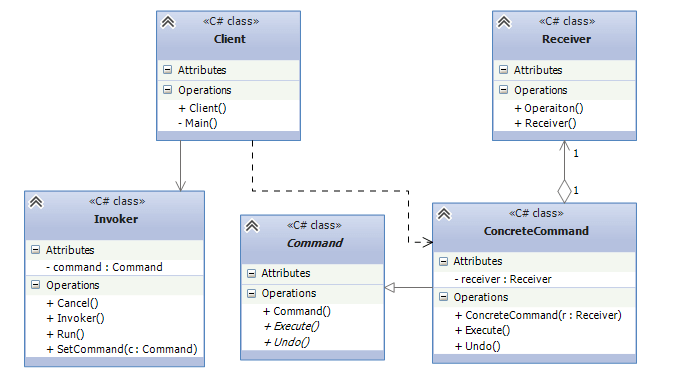

# COMMAND (Команда)
Паттерн "Команда" (Command) позволяет инкапсулировать запрос на выполнение определенного действия в виде отдельного объекта. 
Этот объект запроса на действие и называется командой. При этом объекты, инициирующие запросы на выполнение действия, отделяются от объектов, которые выполняют это действие.

Команды могут использовать параметры, которые передают ассоциированную с командой информацию. Кроме того, команды могут ставиться в очередь и также могут быть отменены.

## Когда применяется цепочка обязанностей:
* Когда надо передавать в качестве параметров определенные действия, вызываемые в ответ на другие действия. То есть когда необходимы функции обратного действия в ответ на определенные действия.
* Когда необходимо обеспечить выполнение очереди запросов, а также их возможную отмену.
* Когда надо поддерживать логгирование изменений в результате запросов. 
Использование логов может помочь восстановить состояние системы - для этого необходимо будет использовать последовательность запротоколированных команд.

## Участники согласно диаграмме:

### Command: 
Интерфейс, представляющий команду. Обычно определяет метод Execute() для выполнения действия, а также нередко включает метод Undo(), 
реализация которого должна заключаться в отмене действия команды

### ConcreteCommand: 
Конкретная реализация команды, реализует метод Execute(), в котором вызывается определенный метод, определенный в классе Receiver

### Receiver: 
Получатель команды. Определяет действия, которые должны выполняться в результате запроса.

### Invoker: 
Инициатор команды - вызывает команду для выполнения определенного запроса

### Client:
Клиент - создает команду и устанавливает ее получателя с помощью метода SetCommand()

Таким образом, инициатор, отправляющий запрос, ничего не знает о получателе, который и будет выполнять команду. 
Кроме того, если нам потребуется применить какие-то новые команды, мы можем просто унаследовать классы от абстрактного класса Command и реализовать его методы Execute и Undo.

В программах на C# команды находят довольно широкое применение. Так, в технологии WPF и других технологиях, которые используют XAML и подход MVVM, 
на командах во многом базируется взаимодействие с пользователем. В некоторых архитектурах, например, в архитектуре CQRS, команды являются одним из ключевых компонентов.

Нередко в роли инициатора команд выступают панели управления или кнопки интерфейса. Самая простая ситуация - надо программно организовать включение и выключение прибора, например, телевизора.