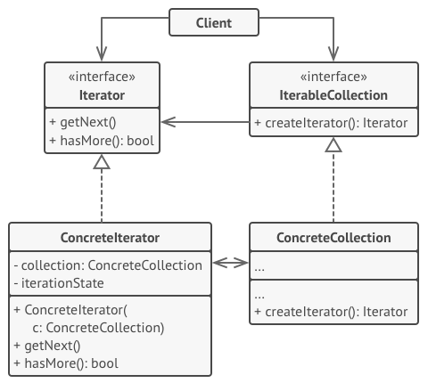

## ITERATOR (Итератор)
Паттерн Итератор (Iterator) предоставляет абстрактный интерфейс для последовательного доступа ко всем элементам составного объекта 
без раскрытия его внутренней структуры.

Но как бы ни была структурирована коллекция, пользователь должен иметь возможность последовательно обходить её элементы, 
чтобы проделывать с ними какие-то действия.
Но каким способом следует перемещаться по сложной структуре данных? Например, сегодня может быть достаточным обход дерева в глубину, 
но завтра потребуется возможность перемещаться по дереву в ширину.
А на следующей неделе и того хуже — понадобится обход коллекции в случайном порядке.

## Use cases:

* Когда у вас есть сложная структура данных, и вы хотите скрыть от клиента детали её реализации (из-за сложности или вопросов безопасности).

 Итератор предоставляет клиенту всего несколько простых методов перебора элементов коллекции. 
 Это не только упрощает доступ к коллекции, но и защищает её данные от неосторожных или злоумышленных действий.

* Когда вам нужно иметь несколько вариантов обхода одной и той же структуры данных.

 Нетривиальные алгоритмы обхода структуры данных могут иметь довольно объёмный код. 
 Этот код будет захламлять всё вокруг — будь то сам класс коллекции или часть бизнес-логики программы. 
 Применив итератор, вы можете выделить код обхода структуры данных в собственный класс, упростив поддержку остального кода.

* Когда вам хочется иметь единый интерфейс обхода различных структур данных.

 Итератор позволяет вынести реализации различных вариантов обхода в подклассы. 
 Это позволит легко взаимозаменять объекты итераторов, в зависимости от того, с какой структурой данных приходится работать.

## Преимущества и недостатки:
Преимущества:
* Упрощает классы хранения данных.
* Позволяет реализовать различные способы обхода структуры данных.
* Позволяет одновременно перемещаться по структуре данных в разные стороны.

Недостатки:
* Не оправдан, если можно обойтись простым циклом.

## Отличия от других паттернов:
* Вы можете обходить дерево Компоновщика(Composite), используя Итератор.
* Фабричный метод можно использовать вместе с Итератором, чтобы подклассы коллекций могли создавать подходящие им итераторы.

* Снимок(Memento) можно использовать вместе с Итератором, чтобы сохранить текущее состояние обхода структуры данных и вернуться к нему в будущем, если потребуется.

* Посетитель(Visitor) можно использовать совместно с Итератором. Итератор будет отвечать за обход структуры данных, 
а Посетитель — за выполнение действий над каждым её компонентом.