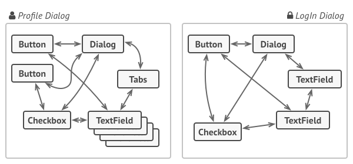
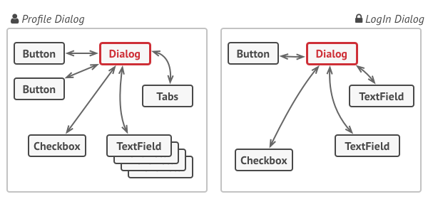

## Mediator (Посредник)
Это поведенческий паттерн проектирования, который позволяет уменьшить связанность множества классов между собой, 
благодаря перемещению этих связей в один класс-посредник.

### Пример:
* Отдельные элементы диалога должны взаимодействовать друг с другом. 
Так, например, чекбокс «у меня есть собака» открывает скрытое поле для ввода имени домашнего любимца, 
а клик по кнопке отправки запускает проверку значений всех полей формы.
* Прописав эту логику прямо в коде элементов управления, вы поставите крест на их повторном использовании в других местах приложения. 
Они станут слишком тесно связанными с элементами диалога редактирования профиля, 
которые не нужны в других контекстах. Поэтому вы сможете использовать либо все элементы сразу, либо ни одного.

Но как бы ни была структурирована коллекция, пользователь должен иметь возможность последовательно обходить её элементы, 
чтобы проделывать с ними какие-то действия.
Но каким способом следует перемещаться по сложной структуре данных? Например, сегодня может быть достаточным обход дерева в глубину, 
но завтра потребуется возможность перемещаться по дереву в ширину.
А на следующей неделе и того хуже — понадобится обход коллекции в случайном порядке.

## Use cases:

* Когда вам сложно менять некоторые классы из-за того, что они имеют множество хаотичных связей с другими классами.

* Посредник позволяет поместить все эти связи в один класс, после чего вам будет легче их отрефакторить, сделать более понятными и гибкими.

* Когда вы не можете повторно использовать класс, поскольку он зависит от уймы других классов.

* После применения паттерна компоненты теряют прежние связи с другими компонентами, а всё их общение происходит косвенно, через объект-посредник.

* Когда вам приходится создавать множество подклассов компонентов, чтобы использовать одни и те же компоненты в разных контекстах.

* Если раньше изменение отношений в одном компоненте могли повлечь за собой лавину изменений во всех остальных компонентах, 
то теперь вам достаточно создать подкласс посредника и поменять в нём связи между компонентами.

## Преимущества и недостатки:
Преимущества:
* Упрощает классы хранения данных.
* Позволяет реализовать различные способы обхода структуры данных.
* Позволяет одновременно перемещаться по структуре данных в разные стороны.

Недостатки:
* Не оправдан, если можно обойтись простым циклом.

## Отличия и взаимодействие с другими паттернами:
1. Цепочка обязанностей, Команда, Посредник и Наблюдатель показывают различные способы работы отправителей запросов с их получателями:
* Цепочка обязанностей передаёт запрос последовательно через цепочку потенциальных получателей, ожидая, что какой-то из них обработает запрос.
* Команда устанавливает косвенную одностороннюю связь от отправителей к получателям.
* Посредник убирает прямую связь между отправителями и получателями, заставляя их общаться опосредованно, через себя.
* Наблюдатель передаёт запрос одновременно всем заинтересованным получателям, но позволяет им динамически подписываться или отписываться от таких оповещений.

2. Посредник и Фасад похожи тем, что пытаются организовать работу множества существующих классов.
* Фасад создаёт упрощённый интерфейс к подсистеме, не внося в неё никакой добавочной функциональности. 
Сама подсистема не знает о существовании Фасада. Классы подсистемы общаются друг с другом напрямую.
* Посредник централизует общение между компонентами системы. Компоненты системы знают только о существовании Посредника, 
у них нет прямого доступа к другим компонентам.

3. Разница между Посредником и Наблюдателем не всегда очевидна. Чаще всего они выступают как конкуренты, но иногда могут работать вместе.

* Цель Посредника — убрать обоюдные зависимости между компонентами системы. Вместо этого они становятся зависимыми от самого посредника. 
С другой стороны, цель Наблюдателя — обеспечить динамическую одностороннюю связь, в которой одни объекты косвенно зависят от других.
* Довольно популярна реализация Посредника при помощи Наблюдателя. При этом объект посредника будет выступать издателем, 
а все остальные компоненты станут подписчиками и смогут динамически следить за событиями, происходящими в посреднике. 
В этом случае трудно понять, чем же отличаются оба паттерна.
Но Посредник имеет и другие реализации, когда отдельные компоненты жёстко привязаны к объекту посредника. 
Такой код вряд ли будет напоминать Наблюдателя, но всё же останется Посредником.
* Напротив, в случае реализации посредника с помощью Наблюдателя представим такую программу, 
в которой каждый компонент системы становится издателем. Компоненты могут подписываться друг на друга, в то же время не привязываясь к конкретным классам. 
Программа будет состоять из целой сети Наблюдателей, не имея центрального объекта-Посредника.