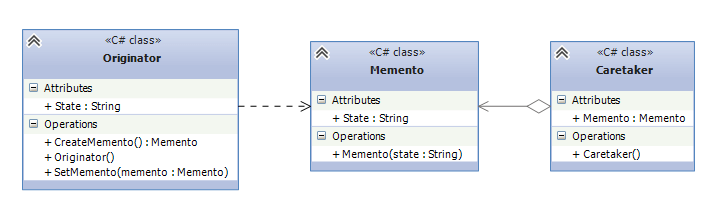
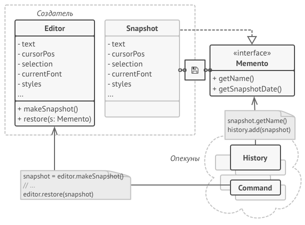

## Memento (Хранитель \ Снимок)
Паттерн Хранитель (Memento) позволяет выносить внутреннее состояние объекта за его пределы
для последующего возможного восстановления объекта без нарушения принципа инкапсуляции.

Когда использовать Memento?
* Когда нужно сохранить состояние объекта для возможного последующего восстановления.
* Когда сохранение состояния должно проходить без нарушения принципа инкапсуляции.

## Участники:
Участники
* Memento: хранитель, который сохраняет состояние объекта Originator и предоставляет полный доступ только этому объекту Originator.

* Originator: создает объект хранителя для сохранения своего состояния.

* Caretaker: выполняет только функцию хранения объекта Memento, в то же время у него нет полного доступа к хранителю и никаких других операций над хранителем, 
кроме собственно сохранения, он не производит.

### Пример:
Чтобы сделать копию состояния объекта, достаточно скопировать значение его полей. 
Таким образом, если вы сделали класс редактора достаточно открытым, то любой другой класс сможет заглянуть внутрь, чтобы скопировать его состояние.

## Пример проблемы с инкапсуляцией:
Казалось бы, что ещё нужно? Ведь теперь любая операция сможет сделать резервную копию редактора перед своим действием. 
Но такой наивный подход обеспечит вам уйму проблем в будущем.
Ведь если вы решите провести рефакторинг — убрать или добавить парочку полей в класс редактора — то придётся менять код всех классов, 
которые могли копировать состояние редактора.

## Решение:

Паттерн Снимок поручает создание копии состояния объекта самому объекту, который этим состоянием владеет.
Вместо того, чтобы делать снимок «извне», наш редактор сам сделает копию своих полей, ведь ему доступны все поля, даже приватные.
Паттерн предлагает держать копию состояния в специальном объекте-снимке с ограниченным интерфейсом, позволяющим, например,
узнать дату изготовления или название снимка. Но, с другой стороны, снимок должен быть открыт для своего создателя,
позволяя прочесть и восстановить его внутреннее состояние.

## Use cases:

* Когда вам нужно сохранять мгновенные снимки состояния объекта (или его части), чтобы впоследствии объект можно было восстановить в том же состоянии.

*Паттерн Снимок позволяет создавать любое количество снимков объекта и хранить их, независимо от объекта, с которого делают снимок.
Снимки часто используют не только для реализации операции отмены, но и для транзакций, когда состояние объекта нужно «откатить», если операция не удалась.
* Когда прямое получение состояния объекта раскрывает приватные детали его реализации, нарушая инкапсуляцию.
* Паттерн предлагает изготовить снимок самому исходному объекту, поскольку ему доступны все поля, даже приватные.

## Преимущества и недостатки:
Преимущества:
* Не нарушает инкапсуляции исходного объекта.
* Упрощает структуру исходного объекта. Ему не нужно хранить историю версий своего состояния.

Недостатки:
* Требует много памяти, если клиенты слишком часто создают снимки.
* Может повлечь дополнительные издержки памяти, если объекты, хранящие историю, не освобождают ресурсы, занятые устаревшими снимками.
* В некоторых языках (например, PHP, Python, JavaScript) сложно гарантировать, чтобы только исходный объект имел доступ к состоянию снимка.

## Отличия и взаимодействие с другими паттернами:
1. Команду и Снимок можно использовать сообща для реализации отмены операций. 
В этом случае объекты команд будут отвечать за выполнение действия над объектом, а снимки будут хранить резервную копию состояния этого объекта, 
сделанную перед самым запуском команды.

2. Снимок можно использовать вместе с Итератором, чтобы сохранить текущее состояние обхода структуры данных и вернуться к нему в будущем, если потребуется.

3. Снимок иногда можно заменить Прототипом, если объект, состояние которого требуется сохранять в истории, довольно простой, 
не имеет активных ссылок на внешние ресурсы либо их можно легко восстановить.